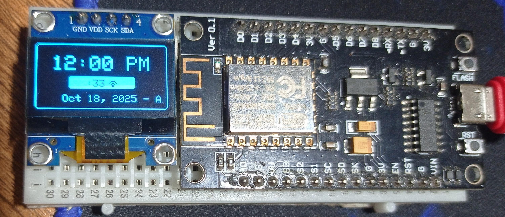
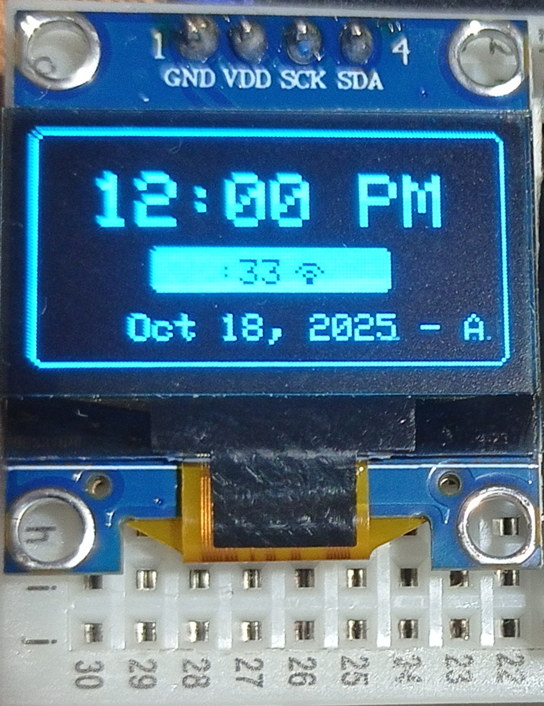
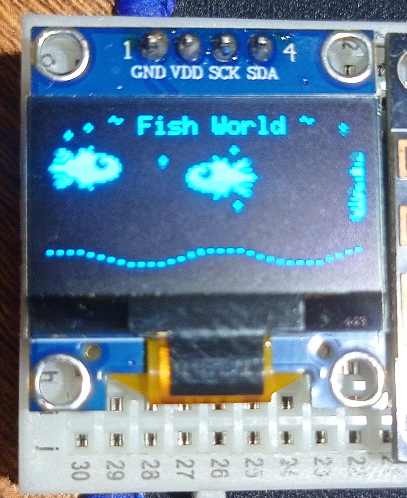
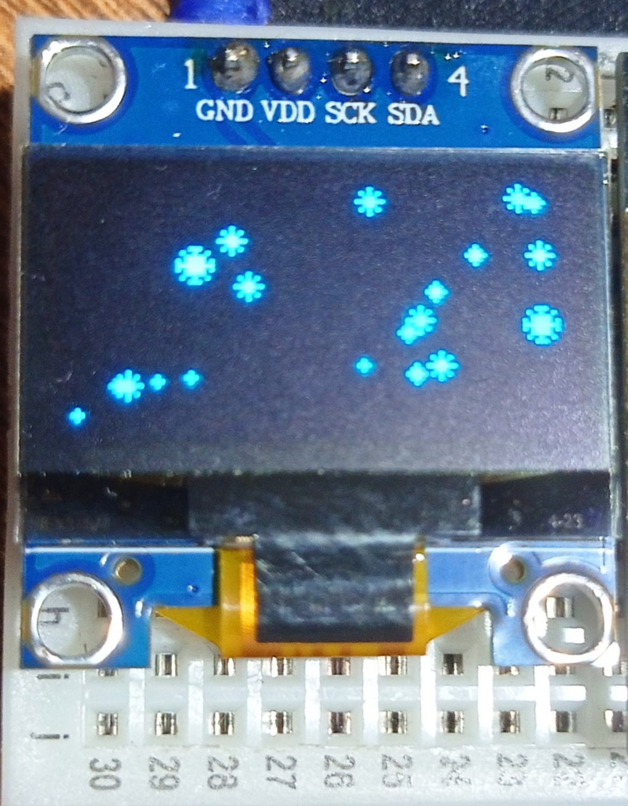
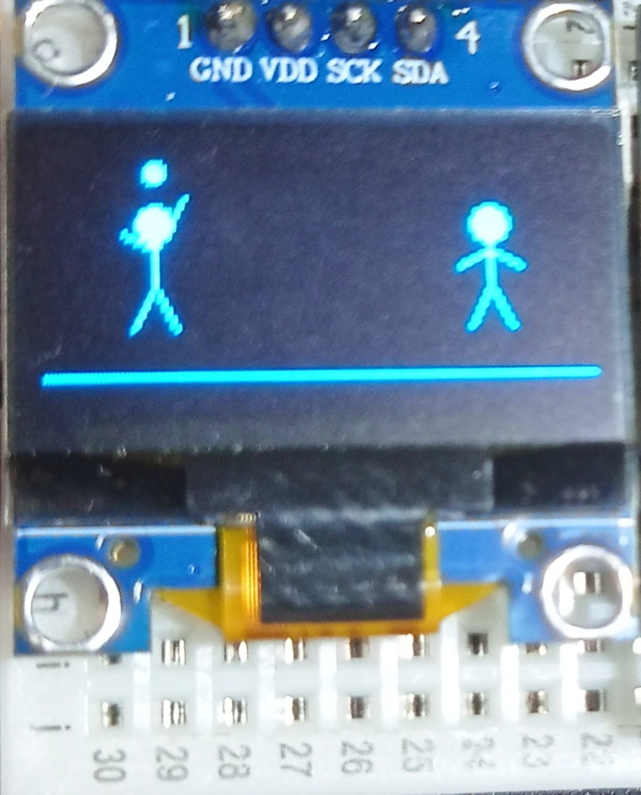
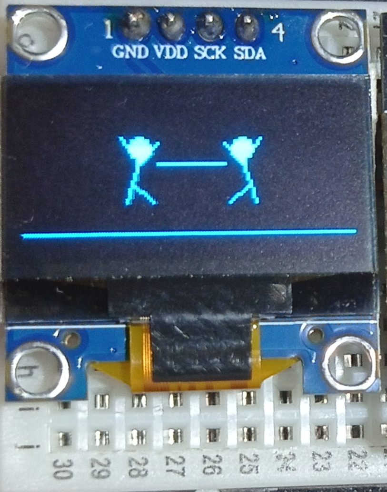

# 🖥️ OLED Desk Display

<div align="center">


</div>

An animated ESP8266-powered OLED display featuring a digital clock, aquarium, starfield, and interactive stick figures!

## 📸 Project Preview

### Full Board View
<div align="center">
  
</div>

### 🎬 Animations in Action
<div align="center">
  <table>
    <tr>
      <td align="center">
        
        <br/>
        <b>🐠 Fishworld Aquarium</b>
        <br/>
        Swimming fish with bubbles
      </td>
      <td align="center">
        
        <br/>
        <b>🙌 High Five!</b>
        <br/>
        Stickmen running to celebrate
      </td>
      <td align="center">
        
        <br/>
        <b>🕺 Stickman Adventures</b>
        <br/>
        Multiple interactive animations
      </td>
    </tr>
  </table>
</div>

### Widget Gallery
<div align="center">
  <table>
    <tr>
      <td align="center">
        
        <br/>
        <b>🕐 Digital Clock</b>
        <br/>
        Real-time with scrolling marquee
      </td>
      <td align="center">
        
        <br/>
        <b>🐠 Aquarium</b>
        <br/>
        Swimming fish with bubbles
      </td>
      <td align="center">
        
        <br/>
        <b>✨ Starfield</b>
        <br/>
        Twinkling stars animation
      </td>
    </tr>
    <tr>
      <td align="center">
        
        <br/>
        <b>⚾ Playing Catch</b>
        <br/>
        Interactive stick figures
      </td>
      <td align="center">
        
        <br/>
        <b>💪 Tug of War</b>
        <br/>
        Epic rope battle
      </td>
      <td align="center">
        <br/>
        <b>🎲 More Animations</b>
        <br/>
        High five, dancing, racing, celebrating!
      </td>
    </tr>
  </table>
</div>

---

## ✨ Features

### 🕐 Digital Clock Widget
- **Real-time sync** from BepariSoft API (Asia/Dhaka timezone)
- **12-hour format** with AM/PM indicator
- **Live seconds** with WiFi status icon
- **Scrolling marquee** with date and custom message
- **Modern bordered design** with rounded corners
- Updates in background even when other widgets are displayed

### 🐠 Aquarium Widget
- **4 animated fish** of different sizes swimming across screen
- **Wagging tails** for realistic movement
- **Rising bubbles** with random spawn patterns
- **Wavy seafloor** with animated sine wave
- Fish respawn at random heights when leaving screen

### ✨ Starfield Widget
- **20 twinkling stars** with 4 brightness levels
- **8-point stars** with glow effects at max brightness
- **Smooth transitions** between brightness levels
- Creates a peaceful, cosmic atmosphere

### 🕺 Stick Man Widget (Dual Characters!)
- **TWO stick figures** interacting with each other
- **6 random animations** that change every 5 seconds:
  - 🙌 High Five - Run toward each other and celebrate
  - 💃 Dancing Together - Synchronized disco moves
  - ⚾ Playing Catch - Toss ball back and forth
  - 🏃 Racing - Sprint to the finish line
  - 💪 Tug of War - Epic rope-pulling battle
  - 🎉 Celebrating - Jump with confetti and joy!

---

## 🏗️ Project Structure

```
OLED-desk/
├── src/
│   ├── main.cpp                    # Main program loop & widget switching
│   │
│   ├── config/                     # Hardware & Network Configuration
│   │   ├── display.h/.cpp          # OLED display initialization
│   │   └── wifi.h/.cpp             # WiFi credentials wrapper
│   │
│   ├── core/                       # Core Utilities
│   │   ├── network.h/.cpp          # WiFi & HTTP/HTTPS client
│   │   └── text.h/.cpp             # Simple text rendering
│   │
│   └── widgets/                    # Display Widgets
│       ├── clock/
│       │   ├── clock.h             # Clock declarations
│       │   └── clock.cpp           # Time sync, display, marquee
│       ├── fishes/
│       │   ├── fishes.h            # Fish widget declarations
│       │   └── fishes.cpp          # Aquarium animation logic
│       ├── stars/
│       │   ├── stars.h             # Stars widget declarations
│       │   └── stars.cpp           # Starfield twinkling logic
│       └── stickman/
│           ├── stickman.h          # Stickman declarations
│           ├── stickman.cpp        # Animation state machine
│           └── animations.cpp      # All 6 interactive animations
│
├── platformio.ini                  # PlatformIO configuration
└── README.md                       # This file
```

---

## 🔄 Program Logic

### **Boot Sequence:**
```
1. Serial communication starts (115200 baud)
2. OLED display initializes
3. WiFi connects → Shows "Connecting to WiFi..."
4. IP address displayed for 2 seconds
5. Time syncs from BepariSoft API
6. Widget rotation begins
```

### **Main Loop Flow:**

```mermaid
┌─────────────────────────────────────────┐
│         Main Loop (every 50ms)          │
├─────────────────────────────────────────┤
│                                         │
│  ┌────────────────────────────────┐    │
│  │  updateClockTime()              │    │ ← Always runs in background
│  │  (keeps time accurate)          │    │   even during other widgets
│  └────────────────────────────────┘    │
│                                         │
│  ┌────────────────────────────────┐    │
│  │  Check if time to switch?       │    │
│  │  Clock: 20 seconds              │    │
│  │  Widgets: 10 seconds each       │    │
│  └────────────────────────────────┘    │
│                                         │
│  ┌────────────────────────────────┐    │
│  │  Display current widget:        │    │
│  │  • Clock (always returns here)  │    │
│  │  • Random: Fish/Stars/Stickman  │    │
│  └────────────────────────────────┘    │
│                                         │
└─────────────────────────────────────────┘
```

### **Widget Selection:**
- After each **Clock display** → Randomly picks: Fish, Stars, or Stickman
- **Unpredictable variety** - never the same pattern twice!

### **Time Management:**
- Clock updates **every second** in background
- Syncs with API **every hour** to prevent drift
- Time never stops, even when showing animations

---

## 🛠️ Hardware

| Component | Details |
|-----------|---------|
| **Board** | NodeMCU 1.0 (ESP-12E Module) |
| **MCU** | ESP8266 @ 80MHz |
| **RAM** | 80KB |
| **Flash** | 4MB |
| **Display** | SSD1306 OLED 128x64 |
| **Interface** | I2C (Address: 0x3C) |
| **WiFi** | ESP8266 built-in 2.4GHz |

---

## 📚 Dependencies

| Library | Version | Purpose |
|---------|---------|---------|
| Adafruit SSD1306 | ^2.5.7 | OLED display driver |
| Adafruit GFX Library | ^1.11.10 | Graphics primitives |
| ArduinoJson | ^7.2.0 | JSON parsing for API |
| Wire | 1.0 | I2C communication |
| ESP8266WiFi | 1.0 | WiFi connectivity |
| ESP8266HTTPClient | 1.2 | HTTP/HTTPS requests |

---

## 🚀 Getting Started

### **Prerequisites:**
- [PlatformIO](https://platformio.org/) installed
- NodeMCU ESP8266 board
- SSD1306 OLED display (128x64)
- USB cable for programming

### **Wiring:**

| OLED Pin | ESP8266 Pin |
|----------|-------------|
| VCC | 3.3V |
| GND | GND |
| SCL | D1 (GPIO5) |
| SDA | D2 (GPIO4) |

### **Installation:**

1. **Clone or download this project**
   ```bash
   git clone <your-repo-url>
   cd OLED-desk
   ```

2. **Configure WiFi** (edit `src/config/wifi.cpp`):
   ```cpp
   const char* WIFI_SSID = "YourWiFiName";
   const char* WIFI_PASSWORD = "YourPassword";
   ```

3. **Build the project:**
   ```bash
   platformio run
   ```

4. **Upload to board:**
   ```bash
   platformio run --target upload
   ```

5. **Monitor serial output:**
   ```bash
   platformio device monitor
   ```

---

## ⚙️ Configuration

### **Timing Settings** (`src/main.cpp`):
```cpp
const unsigned long CLOCK_DURATION = 20000;   // Clock shows for 20 seconds
const unsigned long WIDGET_DURATION = 10000;  // Each widget shows for 10 seconds
```

### **WiFi API** (`src/widgets/clock/clock.cpp`):
```cpp
String url = "https://api.beparisoft.com/";  // Change to your time API
```

### **Marquee Text** (`src/widgets/clock/clock.cpp`):
```cpp
marqueeText = dateStr + " - All Services are up - Moon iOT";  // Customize message
```

---

## 🎨 Widget Details

### **Clock Widget:**
```
╔═══════════════════════════╗
║                           ║
║      12:24 AM             ║  ← Current time
║                           ║
║    ┌───────────┐          ║
║    │ :35  📶   │          ║  ← Seconds + WiFi
║    └───────────┘          ║
║                           ║
║ Oct 18 - Services up →    ║  ← Scrolling marquee
║                           ║
╚═══════════════════════════╝
```

**Key Features:**
- API syncs time every hour
- Marquee scrolls date + custom message
- WiFi icon shows connection status
- Modern rounded border design

### **Fish Widget:**
- 4 fish of different sizes
- Smooth swimming with tail animation
- 8 rising bubbles
- Animated wavy seafloor

### **Stars Widget:**
- 20 stars with 4 brightness levels
- Gradual twinkling effect
- 8-point stars with glow

### **Stickman Widget:**
- 2 characters with 6 interactive animations
- Animations change every 5 seconds
- Smooth 8-frame animations

---

## 📊 Memory Usage

```
RAM:   39.1% (32,024 / 81,920 bytes)
Flash: 41.1% (429,707 / 1,044,464 bytes)
```

**Still plenty of room for more features!** 🚀

---

## 🔧 Customization Tips

### **Add New Widgets:**
1. Create new folder in `src/widgets/your_widget/`
2. Add header and implementation files
3. Include in `main.cpp` and add to widget rotation

### **Modify Animations:**
- Clock: Edit `src/widgets/clock/clock.cpp`
- Fish: Edit `src/widgets/fishes/fishes.cpp`
- Stars: Edit `src/widgets/stars/stars.cpp`
- Stickman: Edit `src/widgets/stickman/animations.cpp`

### **Change Widget Order:**
Modify the widget array in `src/main.cpp`:
```cpp
Widget widgets[] = {FISHES, STARS, STICKMAN};  // Add/remove widgets here
```

---

## 🐛 Troubleshooting

### **Serial Monitor Shows Gibberish:**
- Make sure `monitor_speed = 115200` is in `platformio.ini`
- Restart the serial monitor

### **WiFi Not Connecting:**
- Check SSID and password in `src/config/wifi.cpp`
- Verify 2.4GHz network (ESP8266 doesn't support 5GHz)

### **Time Not Syncing:**
- Check API URL is accessible from your network
- Monitor serial output for HTTP error codes
- Verify JSON response format matches parsing code

### **Display Not Working:**
- Check I2C wiring (SDA, SCL)
- Verify I2C address is 0x3C
- Try different OLED reset pin values

---

## 📝 Code Organization Principles

### **Separation of Concerns:**
- `config/` - Hardware and credentials
- `core/` - Reusable utilities (network, text)
- `widgets/` - Self-contained display modules

### **Header Files:**
- Declarations in `.h` files
- Implementations in `.cpp` files
- Use `extern` for shared global objects
- Include guards on all headers

### **Widget Pattern:**
Each widget follows this structure:
```cpp
void initWidgetName();      // One-time initialization
void updateWidgetName();    // Update state/logic
void displayWidgetName();   // Render to OLED
```

---

## 🎯 Future Enhancement Ideas

- 🌡️ Temperature widget with sensor data
- 📈 Crypto price ticker
- 🎮 Simple games (Snake, Pong)
- 📅 Calendar with events
- 🔔 Notification display via API
- 🎵 Music visualizer
- 🌤️ Weather forecast widget

---

## 🤝 Contributing

Feel free to:
- Add new widgets
- Improve animations
- Optimize code
- Fix bugs
- Enhance documentation

---

## 📄 License

This project is open source. Feel free to use, modify, and distribute.

---

## 🙏 Credits

- **Adafruit** - Display libraries
- **BepariSoft** - Time API
- **PlatformIO** - Build system
- **ESP8266 Community** - Platform support

---

## 📧 Contact

For questions or suggestions about this project, feel free to reach out!
- moon.work247@gmail.com

**Built with ❤️ for the maker community**

---

*Last Updated: October 18, 2025*

